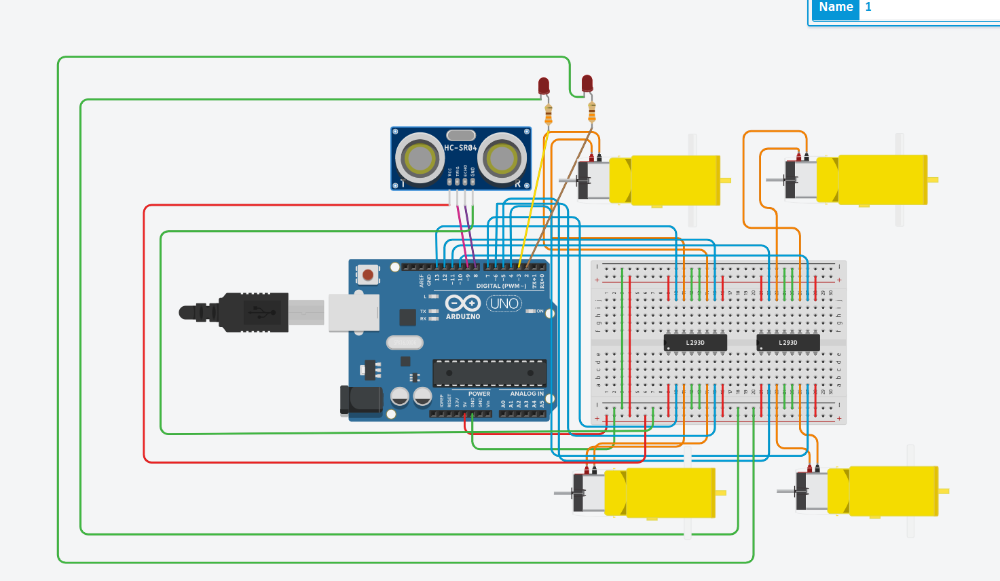
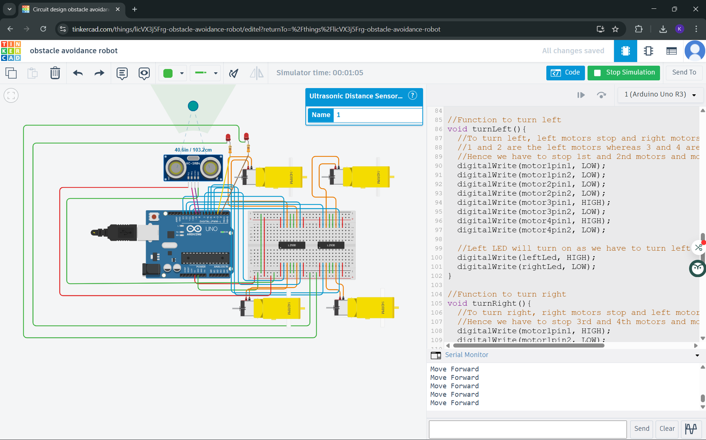

# Obstacle Avoidance Robot

## Overview

In this project, I designed and simulated an obstacle avoidance robot using an Arduino Uno, an HC-SR04 ultrasonic sensor, and L293D motor driver ICs. The robot is capable of detecting obstacles in front of it and automatically changing its direction to avoid collisions. The entire system was implemented and tested using Tinkercad simulation.

## Components Used

* Arduino Uno
* HC-SR04 Ultrasonic Sensor
* L293D Motor Driver ICs
* DC Motors
* LEDs
* Breadboard
* Resistors and Jumper Wires
* Power Supply

## Working Principle

The ultrasonic sensor continuously measures the distance between the robot and any object in front of it. The Arduino calculates the distance using the time taken for the ultrasonic signal to return as an echo.
If the measured distance is greater than the predefined threshold, the robot moves forward. When an obstacle is detected within the threshold distance, the Arduino commands the motors to stop and turn, allowing the robot to avoid the obstacle and continue moving.

## Simulation

### Circuit Design

### Robot Turning Left

### Robot Turning Right

### Robot Moving Forward

## Tools Used

* Tinkercad Circuits
* Arduino IDE
* GitHub

## Conclusion

This project demonstrates how ultrasonic sensing and motor control can be combined to implement basic autonomous navigation in a robotic system. The simulation verifies the logic and behavior before implementing the system on real hardware.
